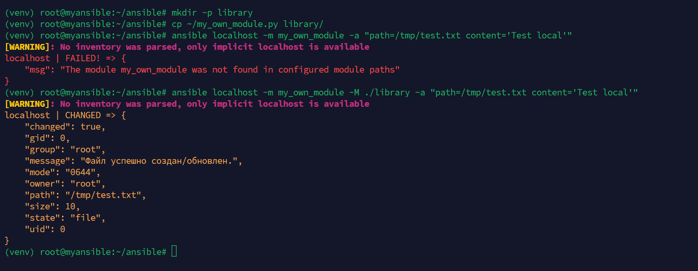
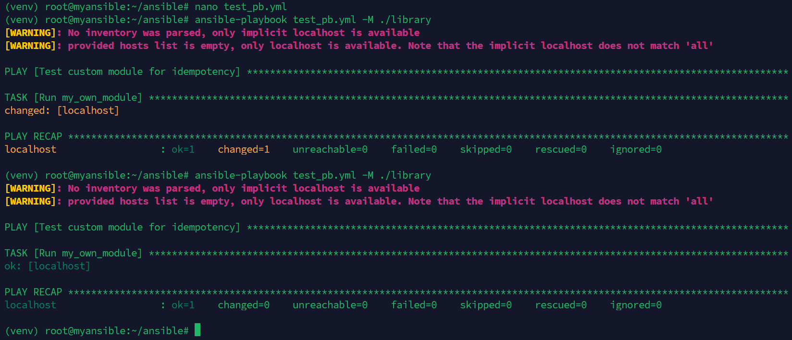
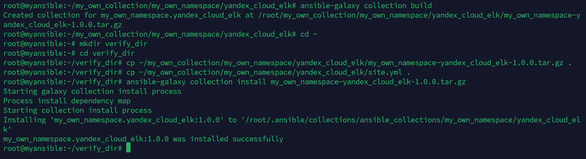
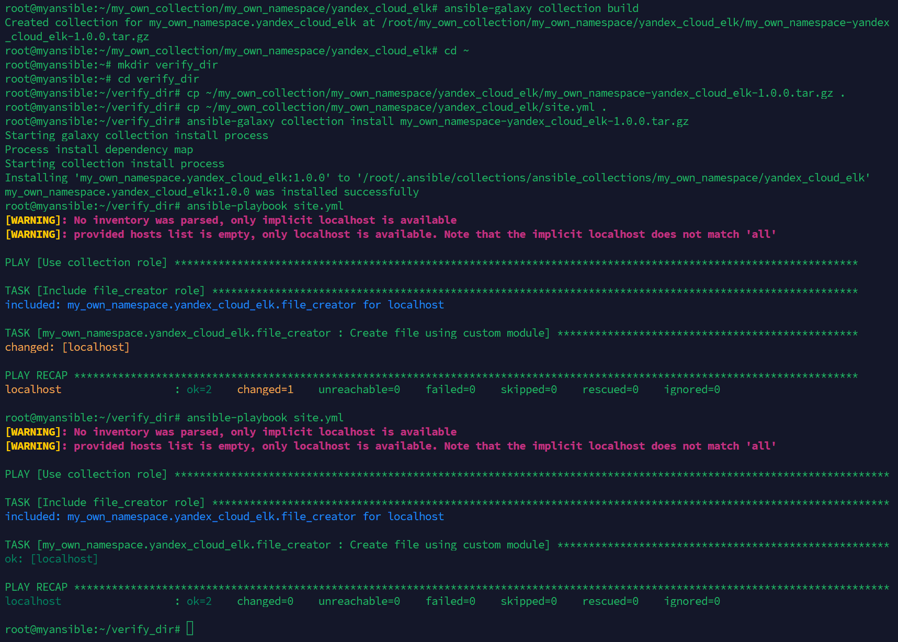

# Домашнее задание к занятию 6 «Создание собственных модулей»

## Ссылки

- **Коллекция (репозиторий):** https://github.com/Dyusenovtt/my_own_collection
- **Архив tar.gz:** https://github.com/Dyusenovtt/my_own_collection/raw/main/my_own_namespace-yandex_cloud_elk-1.0.0.tar.gz

## Скриншоты

### Шаг 4. Локальная проверка модуля

### Шаг 6. Проверка идемпотентности плейбука

### Шаг 15. Установка коллекции из архива

### Шаг 16. Запуск плейбука из установленной коллекции

